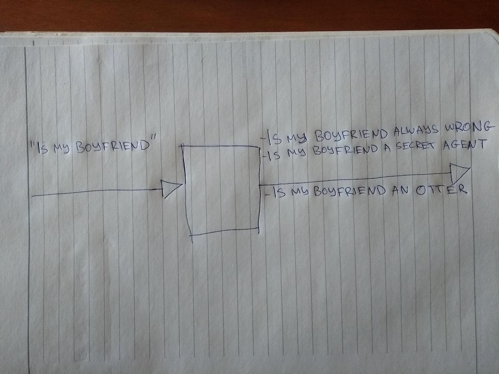

[Last time](2019-09-21-about-my-job.md), we established that software sucks, and that we must do better.
We must do better, because when computer programs fail, what is at stake is real people's time, money,
well-being, or worse, their lives.

(Let me be clear that by "we must do better", I also mean that **I, personally, must continuously attempt to do better.**)

How might we make computer programs better, i.e. less likely to fail?

# Programming got divorced

My dad is a construction engineer (and a good one, I might add), and so, I am keen to draw an analogy from construction again. Notice that buildings (mostly) do not fall apart; on the other 
hand almost all computer programs fail at one point or another.

So what is it that construction engineers do to make sure that buildings do not fall apart?
Well, lots of things, but the gist of it all is that when designing buildings, they observe the laws
of mathematics. More precisely, construction engineers observe the laws of physics, but [physics is
just applied mathematics](https://xkcd.com/435/) if you look under the hood.

> But don't computer programmers do the same? After all, you folks take mathematics exams to go into university, and study more maths in there?

Oh boy, would you be surprised! Sadly, the answer is - usually, no! **Programmers rarely follow the rules of mathematics when they design programs.** I think this is the primary reason most programs fail.

What we mostly do instead is we piece the program together, in the hand-wavy manner in which a painter will create a painting - putting a base, then some layers and figures together, and then some finishing touches - all based on "what feels right". We will then (hopefully) test the program a little bit, and if we don't discover glaring defects, we will declare that it looks good as far as we can tell, and be done with it.

So programmers work more like artisans or craftsmen than engineers, but then the programs will fail - because we forgot to strictly observe the laws of reality when crafting - which is OK for a Dali piece, but really,a poor way to write a program.

**But why?**

Why did programming get divorced from mathematics? And what do we do to bring them back together?
To talk about this, we should first make sure we understand what a program really **is**.
As promised last time, we will do it without technical jargon. Instead, we will draw some pictures.

# The essence of a computer program

An easy way to think about a program is that it takes some sort of input, runs, and when finished provides some output. This is true for all programs, small and large, simple and complex.

Let's look at an example we're all familiar with. The Google auto-complete program takes as input a
search phrase that you provide to it, runs, and returns a list of the titles of the most relevant
web pages matching that search term. You've all seen it in action.

# Things can go wrong

This is a nice, simple model of the program, but it is quite imprecise, if you think carefully. And that's what programming is all about - thinking carefully.

Why imprecise? Well, for one, it says nothing about the things that can go wrong. It's important to think about them, since as Murphy's law says, if things can go wrong, at some point, they will.

For starters, your internet can get disconnected! In that case the program will never get its input, and there will be no search results. Let's depict this by drawing a barbed wire where the input is:

If you do have internet, and the search query does make it in, Google will send it to its servers for processing. But the server in question might be too busy, overheated, or a rat might have bitten its network cable! Beleive it or not, these things happen every day, simply because Google has thousands upon thousands of those servers. Sooner or later, a rat *will* make it into one of those shiny data centers.

Let's depict this by putting some more barbed wire, on the output side:

# Things depend on space and time

> Panta Rhei

As the world changes, and as the internet gets indexed by the tireless Google robots, search results change, too. If you searched for "current american president" back in 2016, and today, in 2019, you would get back (shockingly) different results.

This has practical consequences.

