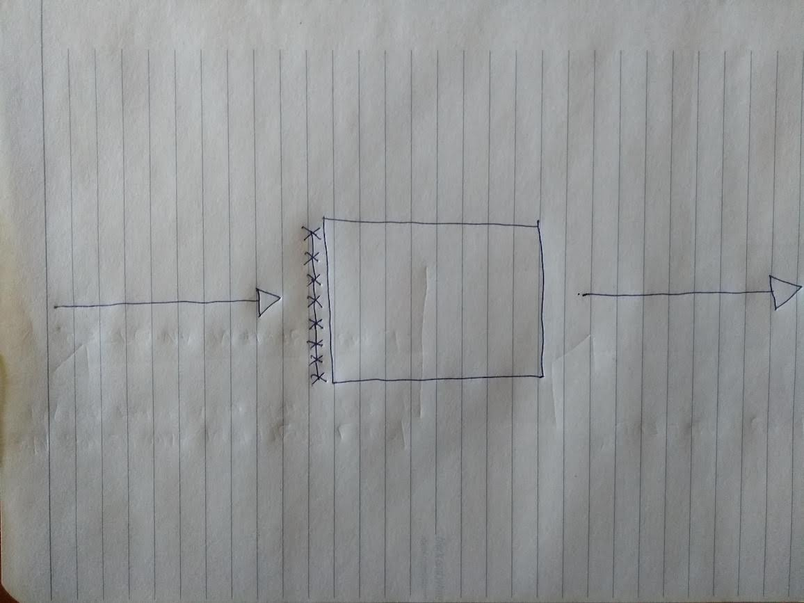
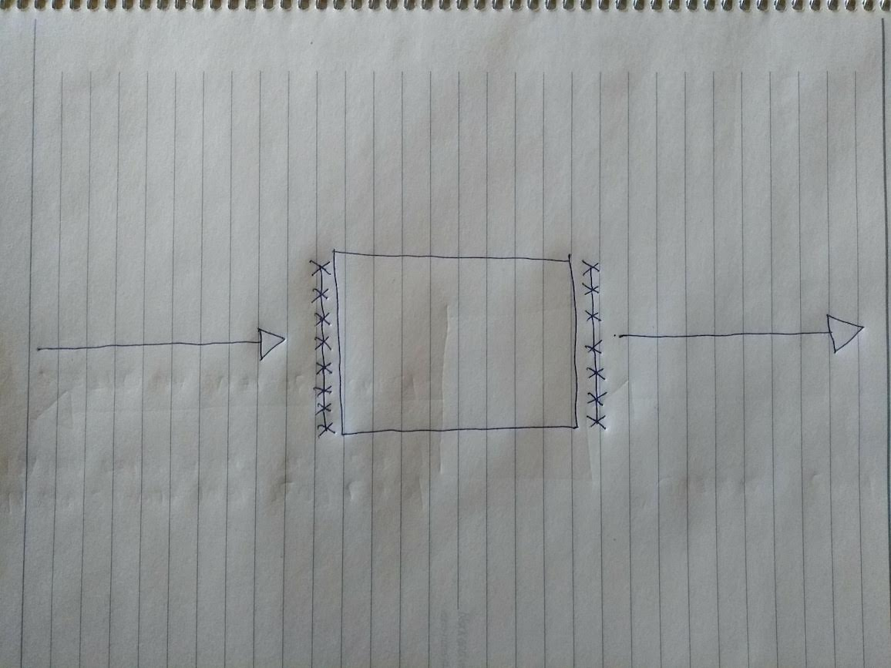
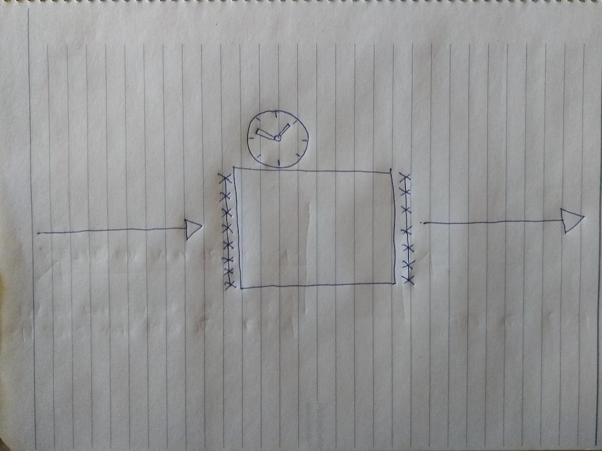
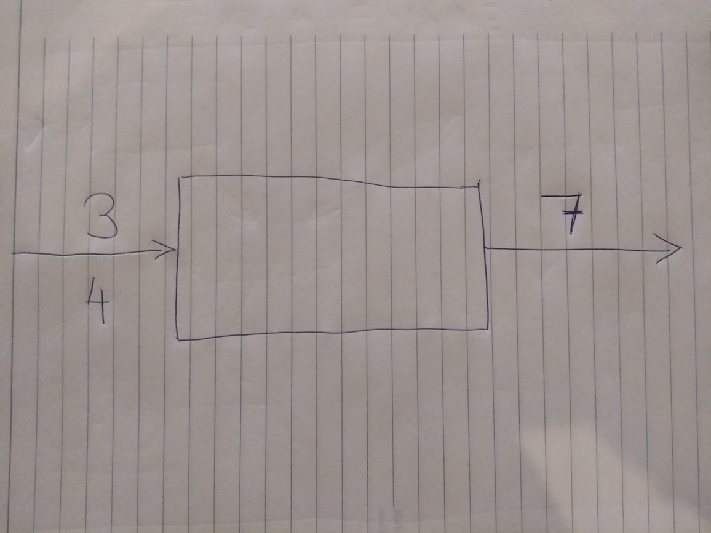
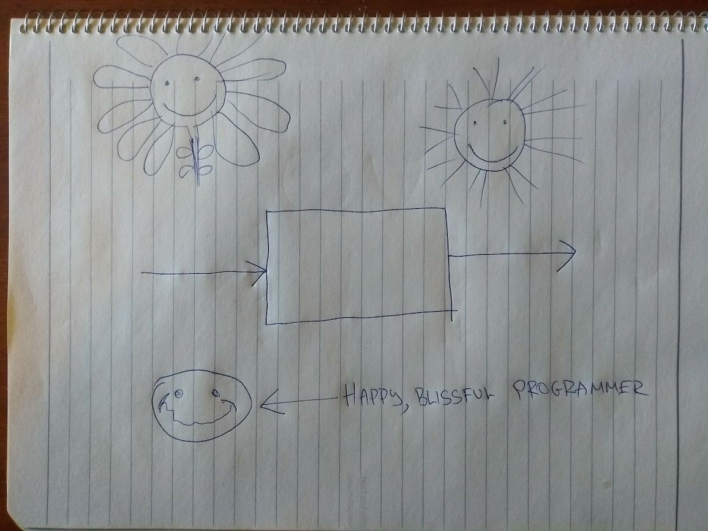
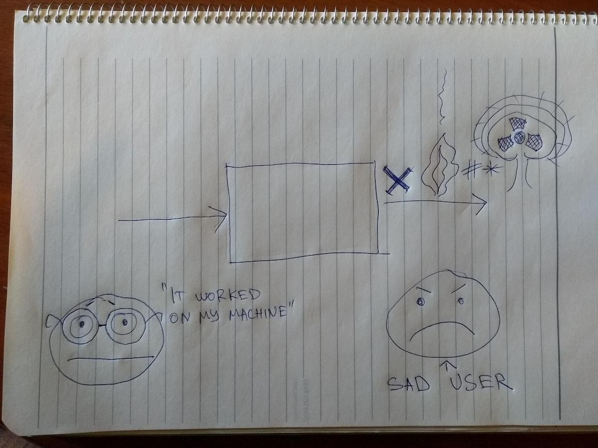
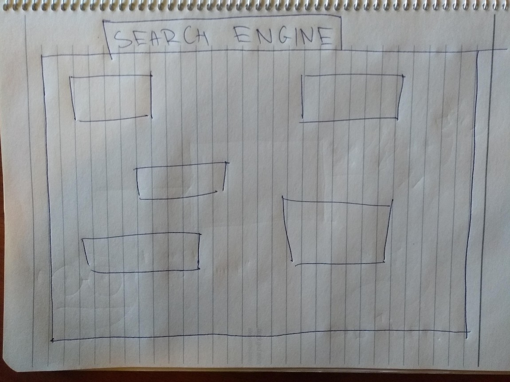
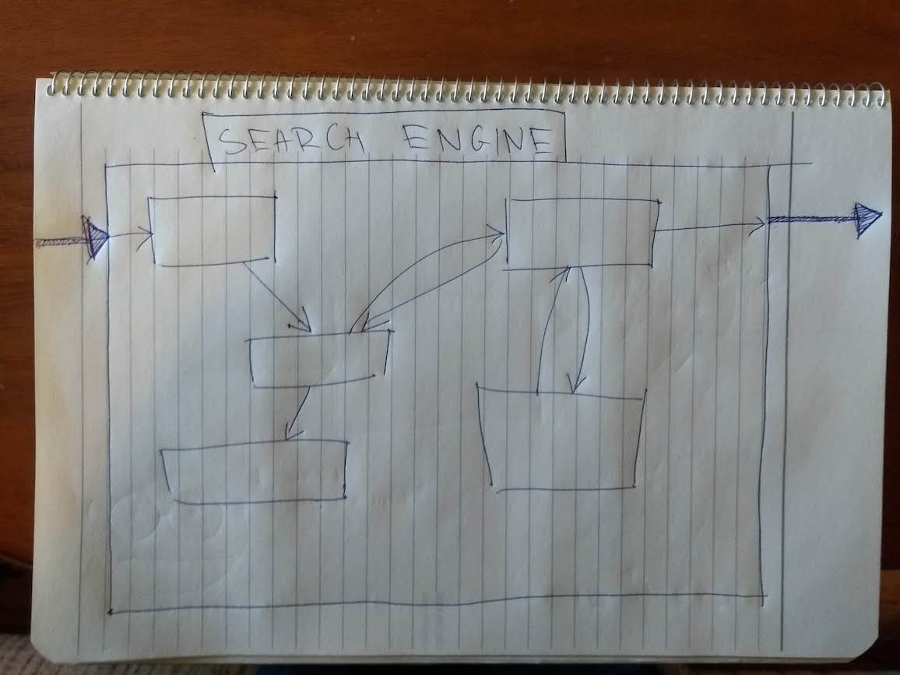

**This post is a draft, I'm still writing it. Just testing in production, move along :) **

[Last time](2019-09-21-about-my-job.md), we established that software sucks, and that we must do better.
We must do better, because when computer programs fail, what is at stake is real people's time, money,
well-being, or worse, their lives.

(Let me be clear that by "we must do better", I also mean that **I, personally, must continuously attempt to do better.**)

How might we make computer programs better, i.e. less likely to fail?

# Programming got divorced

My dad is a construction engineer (and a good one, I might add), and so, I am keen to draw an analogy from construction again. Notice that buildings (mostly) do not fall apart; on the other 
hand almost all computer programs fail at one point or another.

So what is it that construction engineers do to make sure that buildings do not fall apart?
Well, lots of things, but the gist of it all is that when designing buildings, they observe the laws
of mathematics. More precisely, construction engineers observe the laws of physics, but [physics is
just applied mathematics](https://xkcd.com/435/) if you look under the hood.

> But don't computer programmers do the same? After all, you folks take mathematics exams to go into university, and study more maths in there?

Oh boy, would you be surprised! Sadly, the answer is - usually, no! **Programmers rarely follow the rules of mathematics when they design programs.** I think this is the primary reason most programs fail.

What we mostly do instead is we piece the program together in the intuition-driven manner in which, say, a painter will create a painting - starting with a vague idea in our head, then draft a rough sketch, then gradually add aspects, and details, and finishing touches - all based on what *feels* right. Note that this process will still require a lot of skill, but is almost entirely driven by feeling and experience, as opposed to some hard, formal science.

We will then, *hopefully*, test the program a little bit, and if we don't discover glaring defects, we will declare that it looks good as far as we can tell, and be done with it.

So programmers work more like artisans or craftsmen than engineers, but then the programs will fail - because we forgot to strictly observe the laws of reality when crafting - which is good for a Dali piece, but really, a poor way to write a program.

**But why?**

Why did programming get divorced from mathematics? And what do we do to bring them back together?
To talk about this, we should have a commonly understood, rough picture of what programs are.
As promised last time, we will do it without technical jargon. Instead, we will ... draw some pictures.

# A picture of a computer program

An easy way to think about a program is that it takes some sort of input, runs, and when finished provides some output. This is true for all programs, small and large, simple and complex.

Let's look at an example we're all familiar with. The Google auto-complete program takes as input a
search phrase that you provide to it, runs, and returns a list of the titles of the most relevant
web pages matching that search term. You've all seen it in action.

# Things can go wrong

This is a nice, simple model of the program. (From now on, I will use the words "picture" and "model" interchangeably). But it's quite imprecise, if you think carefully. And that's what programming is all about - thinking carefully.

Why imprecise? Well, for one, it says nothing about the things that can go wrong. It's important to think about them, since as Murphy's law says, if things can go wrong, at some point, they will.

For starters, your internet can get disconnected! In that case the program will never get its input, and there will be no search results. Let's depict this by drawing a barbed wire where the input is:

If you do have internet, and the search query does make it in, Google will send it to its servers for processing. But the server in question might be too busy, overheated, or a rat might have bitten its network cable! Beleive it or not, these things happen every day, because Google has thousands upon thousands of those servers. Sooner or later, a rat *will* make it into one of those shiny data centers.

Let's depict this by putting some more barbed wire, on the output side:

# Things depend on space and time

> Panta Rhei

As the world changes, and as the internet gets indexed by the tireless Google robots, search results change, too. If you searched for "current american president" back in 2016, and today, in 2019, you would get back different results. Some might say, shockingly different, but we will abstain from commenting.

This has practical consequences. To save computer time, or internet bandwidth, one might decide to remember the result of a computer program, so it doesn't have to be run again. Your browser does that all the time under the hood. You might have heard of this - it's called "caching".

Well, in our example, this would be plain wrong! The output of our program depends on what the world is at the current point in time! As a consequence, it cannot be cached. Let's depict this by decorating it with a clock:

We might keep refining our picture in greater detail, but let's stop here - you already get the idea.
What happened is that we took a computer program, and started creating a mental model for it. We began with one that was very simple, but too inaccurate. The end result, on the other hand, **reflects reality more closely**. Or at least the parts of reality that we chose to care about:

- What can go wrong
- What **external** factors can affect the program output

You can think of the final model as being more *honest* than the initial one.

# A simpler program

The Google search engine is a huge and complex beast. But I told you a while ago that programs come great and small. Let's look at a humbler program - it's the program that sums two numbers. You give it the numbers to sum as input, and it presents the sum as an output:

Let's try to refine our picture of this program.

...

...

Here is the final result:

That's right! There is nothing to refine. In this case, our simple initial model reflects reality accurately. That's the case because

- You don't need to contact anything on the internet to sum numbers, your computer (or phone) is perfectly capable of doing that on its own
- There's no way the program can fail at all, save for your device running out of electrical power, or something catastrophical happening such as radiation eradicating all electronic devices
- Summing numbers does not depend on space, time, or the current American president. 3 + 4 is 7 today, was, and will be, forevermore. For all you care, you can safely remember (cache) that 3 + 4 is 7, and never need to calculate it again

*One note: since summing numbers is a very simple thing, you might be tempted to think that programs that do not have barbed wire in their pictures are not very interesting. This is not the case - there are plenty of very useful programs that match the simple picture. It's just the variety of life - some programs have all sorts of barbed wire, clocks and bells, and others do not have any at all.*

# Dishonesty leads to divorce

We took quite the detour to discuss what programs are. Let's get back to the question at hand - how did programming get divorced from the fine lady that is Mathematics? The answer is: dishonesty!

Most programmers, by default, when thinking about programs, and building programs, will use the simple picture to try to describe the programs that have barbed wire and bells and clocks! They will pretend that Model 2 is Model 1, because thinking in terms of the simpler model is, well, simpler. Here is a picture of a programmer doing that:

And, by Murphy's law, eventually, the following will inevitably happen:

And no wonder! The now surprised programmer left out important details out of their picture, and the sadness of the user is to be expected:
- If you fail to think about what can go wrong, of course you will be surprised when it does, and will fail to react
- If you fail to think about what external factors your output depends on, of course you will be surprised to get unpredicted output

*For example, in the Boeing 737 Max disaster that I cited last time, the people building the system failed to account for the possibility of a angle-of-attack avionics sensor failing, among many other things. But it turns out those sensors fail often. It's possible lots of barbed wire was missing from their pictures.*

Furthermore, this blissfully unaware program waiting to blow up cannot be much improved by mathematics. The thing about mathematics is that it works with models, just like the pictures we draw here. Once you have established what your model is, maths can help you by giving you hard, rock-solid rules of how the pieces in the model interact together, and what the final result can and cannot be. 

Put another way, a mathematical theory is akin to a program. You feed the theory models as its input, the theory has rules and based on those rules you get output that says what the model means, how it behaves, and so on. It's only natural that if you feed in incorrect models, you will get back incorrect results. Incorrect input makes the rules break apart.

And that, kids, is how Programming divorced Mathematics.

And things will get sligtly worse before they get better. C'est la vie!

# A side note - forgiveness!

*So far we established that software sucks, that it does so because it ignores its natural roots in mathematics, and that it ignores them by being dishonest about what is what. At this point you might think that we programmers are a reckless and careless bunch.*  

*In our defense, a craftsman is shaped by their tools. This simplictic model in which the barbed wires, clocks, warning signs, and other aspects of physical reality are discarded, is deeply rooted in our tools, and this, in turn, [shapes](https://www.cs.cmu.edu/~crary/819-f09/Backus78.pdf) [our](https://www.cs.utexas.edu/users/EWD/transcriptions/EWD10xx/EWD1036.html) thinking. The reasons are historical, but the upshot is, that we're often taught the wrong way through university, our apprenticeships, our jobs, textbooks and conferences. It takes great effort to recover from this damage.*

# On composition

Composition is the process by which the individual parts come together to form a cohesive whole. It is all around us:
- The notes, the pauses, the timbre, the arrangement, the indivuduality of the artist come together to compose a live musical piece
- The particles come together to compose chemicals, compounds, tissues and living organisms
- The individual engagements and pastime activities, when arranged well, come together to compose a satisfying daily schedule

Notice that composition always happens according to some rules. You cannot create music by putting together arbitrary sounds, and life by putting together arbitrary particles. A completely hectic and unprincipled daily schedule is also not likely to be satisfying.

# Building software necessitates composition

In fact, composition is the essence of building software, because the programs are always composed of smaller programs, all the way down to the zeroes and ones that your computer, phone, or smart watch understands. In a sense, all programmers do is compose small pieces into bigger and bigger ones, until they are able to solve their current task.

Let's go back to our Google search program. We represented it in a picture with a single box. Did Google spend millions of dollars and man-hours to build a single box? Yes and no. If you look closer, it's more like this:

You might expect that these boxes themselves are composed of smaller ones, and so forth, until we reach the smallest programs, such as the one that sums two numbers. That's correct.

This picture is incomplete though. The individual pieces interact together. They collaborate together to produce the final output of the program:

(The final output is, as usual, depicted with an arrow going out of the big box. I've painted it thick to differentiate it from the arrows between the small boxes.)

And, as we said, there need to be rules as to how things interact and come together. *You can't just throw sounds together and expect Carmen.* 

Once you have defined the individual boxes, and know what the composition rules are, all is good. The final output of the program is determined by the boxes, the arrows, and the rules.

# Composition needs the barbed wire

I promised the divorce was going to get worse, and here is where it does.

Think about it. We need rules to know where we can put arrows, and what those arrows do - how they affect the final output. But the arrows go *between two boxes*. What, in part, **determines** and arrow, is what box it goes out of, and what box it goes into.

And so, if you fail to be honest about what each box really *is*, you can't say what the arrows are either! The rules break apart again, but this part at a larger scale.

Software sucks because it looks like this:

**TODO add picture**

The waviness of the arrows above represents we're uncertain what they do. Since the output of the big box is determined by the arrows inside, we are also uncertain of the output. 

Because boxes are made of smaller boxes, the bigger a software system gets, and the more levels of boxes it has, the more uncertain we are of the output. This explains why engineers have been able to devise bigger and bigger buildings and machines that do not fall apart. We programmers have also been tasked with delivering systems more and more complex, but have systematically failed to deliver ones that work correctly.

# Winning mathematics back

I am a functional programmer. When tasked with solving a problem, I do the following:

- I break down the problem into small problems, and the small problems into smaller ones, until the problems are small enough to solve easily
- I draw this "break down" as boxes
- I make sure to carefully put the sorts of barbed wire and bells each box needs.
- I connect the boxes with arrows as needed to make them interact together to deliver the final output

The end result looks like this:

**TODO add picture**

Note the roundy things on each arrow in the picture. Those depict rules - the composition rules I was telling you about. The same sort of rules you will find in a mathematical textbook - the ones which allow engineers to create buildings that do not fall apart.

The rules tell me what the arrows mean, and ultimately, what the final output can and cannot possibly be.

The best thing is I do not have to come up with the rules! I get them for free from mathematics, so long as I've been careful to put the barbed wires wherever they are needed.

Here is an example of one such rule. It's a very common rule and I use it every day. It's called *associativity*:

**TODO add picture**

`x+(y+z) = x+(y+z)` will be familiar to you from high school. What this says is I can 
- put together the first and the second box, and then put that together with the third box
- put together the second and the third box, and then put the first box together with that

No matter which of the two ways I go, I will get back the same output. This might not sound like much, but even this simple rule is not true if you forget to put the barbed wire, and your arrows are wavy. Even the simplest rules break down if you aren't honest!

# That's my job!

That's my job! I put barbed wire, I compose things, and try to do it in such a way that we can use more and more of these mathemathical rules, so we can become more certain of the output of our systems.

We functional programmers are trying to slowly win mathematics back. It's a long way from divorce to "happily ever after", but we are a persistent bunch! As I said in the beginning of this story, it matters! It's important that we do better.

Oh, and besides putting all that wire, I have fun! Composing music is fun, but so is composing programs. Musicians shouldn't get *all* the fun.

I will say goodbye with an aphorisms of sorts. You will hear some people say that functional programming is too theoretical. That's not true. The hard and theoretical part is the job of the mathematicians. It is them that make the rules, and sometimes it is them that help us out with which rules to use. We just apply the rules! 

> Functional programming is the applied discipline of making sure software sucks less.

There ya go!

