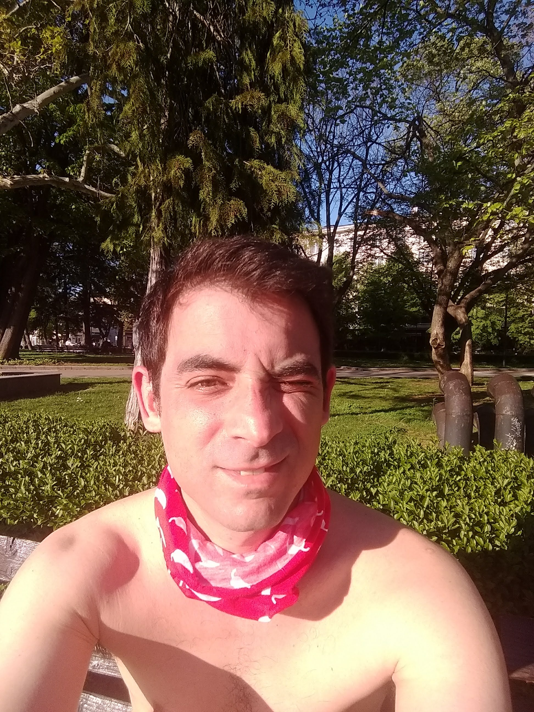

# Един ден на забранено щастие, на границата на закона в НРБ

Днес беше Разпети Петък и цял Ден Свободен от насилствени битови дела, с потенциал за голямо щастие. Никой не е наясно колко такива дни
в славене на Бога са му отредени още, та реших да се възползвам. 

След традиционното кафе, тристашейсеидве цигари, размисли какво по дяволите правих цял четвъртък, щастливо ли изживях
този вече изцяло в миналото ден и след тържествено бръснене, гладът в мен надделя, и се запътих през красивия русенски Площад на Свободата
в търсене на баница и капучино, които знаех точно къде ще намеря.

Това последно нещо може да ви се струва крайно безинтересно и прозаично, но както споделих на мой нов и добър приятел,
възможността да си купя баница и кафе са почва под краката ми, която ми дава нормалност, а и щастие на този вече призрачен
площад, и се опитвам поне трижди в седмицата да се наслаждавам на това удоволствие. Тръгвам!

Времето е страхотно и се наслаждавам на всяка крачка. Моят малък социален бунт е на открито да ходя без маска,
против законите в НРБ и против добрия морал, но спазвайки достолепна дистанция от хората, което ме принуждава комично
да ходя по синусоида и често от тротоар на тротоар. Но заставайки на опашката за баница (и козунаци), вече спазвам закона
и изглеждам според мен респектиращо с моята кърпа (по закон минаваща за маска) на [люти чушки](https://www.facebook.com/ChilipeppersCause/).

Хапвам и пийвам на пейката, пуша още двеста цигари и тегля в произволна посока и на пътя ми се оказва Пролет,
която толкова силно мирише на пролет, живот и красота, че не мога да я подмина:

И сега, братя и сестри, аз се намирам в градинка. Или поне до градинка. Намирам се на границата на закона, и съм
щастлив. И се питам: забраниха ли ни щастието?

Разхождам се на произвол из този мой роден град, към Театъра, и към Операта, и може би към Кея, не не ми се ходи до кея сега
ще ходя по малките пресечки покрай Придунавски днес, яко шляене два часа слънцето пече защо тръгнах с това тежко кожено
яке мръсен рок стар такъв; сега вече го нося в ръка якето; изпълвам се все повече с щастие, незаконно щастие, щастието незаконно ли е?,

усмихвам се на хората, може би ще им дам спокойствие; някои ме гледат с укор (без маска съм), някои са с маски; има жени
с маски с украса и цвят, които им се съчетават с чантите (някой прави пари от това, респект), има и мъже с маски, които им
се съчетават с дрехите ... аз си имам само бъф на люти чушки, приятели, все пак дойдох тук за четири дена само, ама тя каква
стана :)

Някои пък изобщо не ме гледат и те са в собственото си щастие, и тези точно са ми любимите минувачи.

Срещам добър приятел с компания, който ме кани на кея да пием бира, и за момент се захласвам по възможността да прекарам 
цялата светла част от деня в [бирена безметежност](https://www.youtube.com/watch?v=Hlp_DLN8ijQ), ама моят план е друг,
наздраве брат, може да се чуем друг ден.
 
Шлая се още малко, видях класната на Американсото, тя ме пита на шега защо съм
без маска, ама много добре знае защо съм без маска, по-добре от мен знае, понеже ме познава от ей такъв келеш.
Поговорихме, хубаво беше, тръгвам си

, отивам за най-неприятната част от седмицата - неделен пазар, а е едва петък - бързо
и лесно мина, хвала.

Време за бягане! Йе! Имаме си едно местенце дето е ни баш законно ни баш незаконно - то някой знае ли какъв точно е закона ...
 
Та въпрос на прочит, братя, и на търсене на щастието. Ако искате да гледате дявол как чете Евангелие, гледайте бегачи в 
извънредно положение ... Ама то пък и едно евангелие.

Пече слънце, лее се пот, Дунав ти отляво ... Реката, реката е кафеникакво-зелена обикновено покрай Русе, ама като напече хубаво слънцето
става една оптична илюзия и е едно наситено синьо, все едно си на Средиземноморие ... Красиво

На отиване добре, на връщане не толкова добре, към края мъка ... ама стигаш накрая до моста, или до Речна или до където
си се запътил и е Щастие, Полузаконно Щастие

И сега идва време за истинското щастие на границата на закона! Понеже какво се прави след бягане? Пие се бира!

Ей така:

И забележете, приятели! Зад мен има градинка! Ама аз не съм в градинката. Аз съм на площад Свобода. Така че всичко е ток
и жица! Площадът не е градинка; и Свобода не е забранена

Този последен адвокатски съвет ми бе даден лично от моят отец, с когото бяхме, разбира се, на почтително разстояние от една
пейка. Това уточнение е за моралистите и фалшивите герои, каквито вие не сте, нали?

Законно щастие на границата на градинката!

## Епилог

След душ и таратор с чесън моят ден завършва на Левента с още няколкобири, по експертен съвет на мой добър приятел. 
Историята завършва с полиция, понеже, да знаете, на Левента има камери. Разбира се, в този момент спазвах законите на 
НРБ, бидейки заедно с количество хора в затворения интервал [0..1]. Спазването на социална дистанция с хора извън този
интервал беше ненужно, понеже такива нямаше.

Поради текущо напрегнатата ситуация, напълно не в мой стил, избегнах да споделям изненадата и несъгласието си с тези мерки на властта.
 
Моето дълбоко убеждение е, че забележката на полицията беше в посока моята смелост да бъда Щастлив на Поляна. 
Най-близките същества на тази поляна, които можеха да бъдат заразени от коронавирус, бяха кърлежи.

Всъщност смятам, че властта се опита да ме опази от кърлежи, и затова бях изгонен от поляната.

Но всичко това е със слабо значение, думата ми е за друго, драги читателю:
Времената са смутни, и наредбите се менят бързо и хаотично, но:
 
Щастието (още) не е незаконно. Аз ти го желая, а ти си го търси :)

